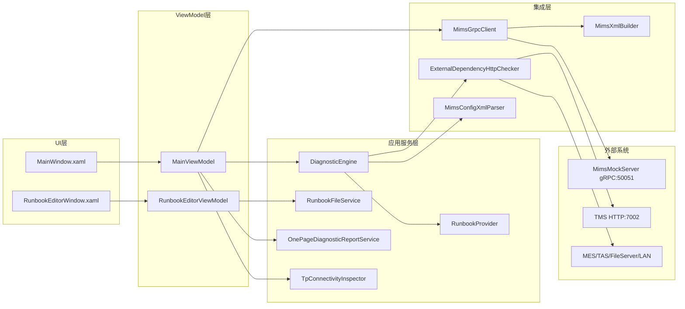
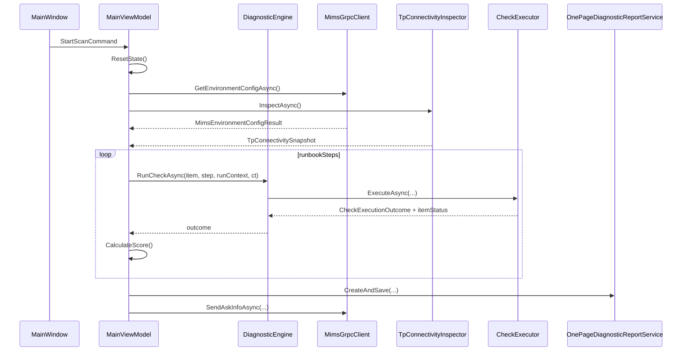
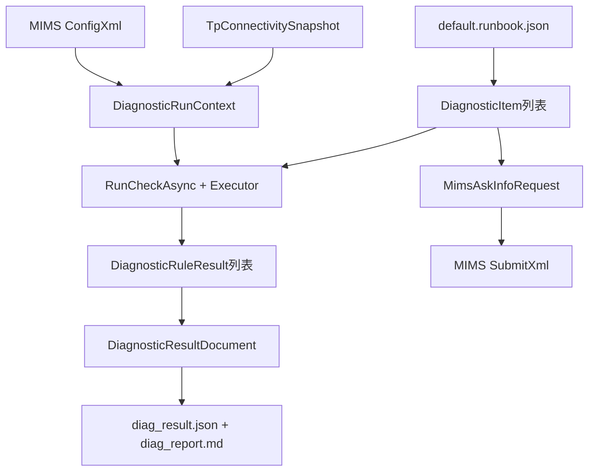

# MockDiagTool 设计文档 V1.0

## 1. 文档信息

- 文档名称: MockDiagTool 设计文档
- 版本: V1.0
- 适用范围: `mockTool`（WPF 客户端 + MIMS Mock Server）
- 目标读者: 研发、测试、运维、现场导入工程师

## 2. 背景与目标

`mockTool` 是一个 RunBook 驱动的自动诊断与运维辅助工具。它通过统一的检查编排框架，对本机、外部依赖、TP 工站能力进行巡检，最终生成一页报告并可上报 MIMS。

本设计文档目标:

1. 说明核心业务流（扫描、停止、单项修复、上报、报告）
2. 说明核心数据流（配置 -> 上下文 -> 检查结果 -> 报告/上报）
3. 给出模块边界与扩展方式（新增检查项、扩展 RunBook、扩展报告）

## 3. 总体架构

### 3.1 架构分层

### 3.2 关键入口

- 应用启动: `mockTool/App.xaml.cs`
- 主界面入口: `mockTool/MainWindow.xaml`
- 业务编排入口: `mockTool/ViewModels/MainViewModel.cs`
- 诊断执行引擎: `mockTool/Services/DiagnosticEngine.cs`
- 报告服务: `mockTool/Services/OnePageDiagnosticReportService.cs`

## 4. 核心业务流

### 4.1 扫描主流程（Start Scan）

主流程由 `StartScanCommand` 驱动，入口在 `MainViewModel.StartScanAsync()`:

1. `ResetState()`: 加载 RunBook、构建 `DiagnosticItems`、重置计数与状态
2. 并行构建运行上下文 `BuildRunContextAsync()`  
   - `GetEnvironmentConfigAsync()` 获取 MIMS 环境 XML  
   - `TpConnectivityInspector.InspectAsync()` 获取 TP 连通性快照（含缓存）
3. 进入 RunBook 循环，按 `NextOnSuccess/NextOnFailure` 分支推进
4. 每一步调用 `DiagnosticEngine.RunCheckAsync()` 执行检查
5. 更新计分、计数、当前项状态
6. 扫描结束后自动执行: 一页报告生成 + MIMS 自动上报

### 4.2 扫描时序图

### 4.3 其他核心动作

- 停止扫描: `StopScanCommand` -> `_cts.Cancel()`，主循环捕获取消后退出
- 单项修复: `FixItemCommand` 仅对 `Warning/Fail` 项生效，更新为 `Fixed` 并重算分数
- 手动上报: `SendToMimsCommand`（受 `CanSendToMims` 约束）
- 手动报告: `ExportOnePageReportCommand`（受 `CanExportOnePageReport` 约束）
- RunBook 编辑器: `OpenRunbookEditorCommand` -> 弹出编辑窗口，保存后可重载

说明: `FixAllCommand` 已从当前版本移除，仅保留单项修复。

### 4.4 状态机与命令可用性

| 命令 | 主要前置条件 | 主要影响状态 |
|---|---|---|
| StartScanCommand | `!IsScanning` | `IsScanning`、`ScanComplete`、`DiagnosticItems`、计分/计数 |
| StopScanCommand | `IsScanning` | 触发取消，结束后 `IsScanning=false` |
| FixItemCommand | 项状态为 `Warning/Fail` | 项状态转 `Fixed`，更新 `DisplayScore` |
| SendToMimsCommand | `!IsScanning && !IsReportingToMims && (ScanComplete || ScannedItems>0)` | `IsReportingToMims`、`StatusText` |
| ExportOnePageReportCommand | `!IsScanning && (ScanComplete || ScannedItems>0)` | `LastReportStatus` |
| OpenRunbookEditorCommand | `!IsScanning` | 打开编辑器，可能触发 RunBook 刷新 |

## 5. 核心数据流

### 5.1 数据生命周期图

### 5.2 输入数据

1. RunBook 配置  
   - 文件: `mockTool/config/runbook/default.runbook.json`  
   - 定义步骤、分支、超时、检查参数
2. 外部环境配置  
   - 来源: `MimsGrpcClient.GetEnvironmentConfigAsync()`  
   - 内容: 各外部 API 地址、工位能力阈值、电源阈值
3. TP 连通性快照  
   - 来源: `TpConnectivityInspector.InspectAsync()`  
   - 包含串口映射、网络端点可达性、配置文件发现结果

### 5.3 中间数据

- `DiagnosticRunContext`: 扫描期间共享上下文
- `DiagnosticItem`: 每个检查项的状态载体
- `CheckExecutionOutcome`: 单步骤执行结果（成功/失败）
- `ExternalDependencyCheckResult`: 外部依赖检查结果

### 5.4 输出数据

1. 一页报告文档  
   - 模型: `DiagnosticResultDocument`  
   - 产物: `logs/reports/diag_result_{runId}.json`、`diag_report_{runId}.md`
2. MIMS 上报请求  
   - 模型: `MimsAskInfoRequest`  
   - 通过 gRPC `SubmitXml` 发送

## 6. 模块设计

### 6.1 UI 与 ViewModel

- `MainWindow.xaml`: 命令绑定、状态展示、诊断结果列表
- `MainViewModel`: 业务编排核心（扫描主流程、状态机、外部集成、报告、上报）

### 6.2 诊断执行层

- `DiagnosticEngine`: 统一执行入口
- `CheckExecutorRegistry`: `checkId -> ICheckExecutor` 映射
- `DelegateCheckExecutor`: 以委托快速注册检查逻辑

执行器类别:

1. 系统检查（SYS/DSK/NET/SEC/SFT/PRF）
2. 外部依赖检查（EXT_*）
3. TP 与光学能力检查（TP_*）

### 6.3 集成层

- `MimsGrpcClient`: gRPC 通道调用（配置获取 + 结果上报）
- `MimsXmlBuilder`: ASK_INFO XML 生成
- `MimsConfigXmlParser`: 从 XML 解析外部依赖接口地址
- `ExternalDependencyHttpChecker`: POST 健康检查

### 6.4 报告层

- `OnePageDiagnosticReportService`:
  - 汇总 `DiagnosticItem` 为 `DiagnosticRuleResult`
  - 结合 `RuleCatalog` 输出规则码、严重级、动作与升级路径
  - 写出 JSON + Markdown 报告

### 6.5 RunBook 编辑与治理

- `RunbookEditorViewModel` / `RunbookEditorWindow`:
  - 可视化编辑步骤
  - ParamsJson 实时 JSON 校验
  - 自动重链 `nextOnSuccess/nextOnFailure`
- `RunbookFileService.Validate()`:
  - 校验 StepId/CheckId
  - 校验分支引用必须指向启用步骤

## 7. 外部接口与配置

### 7.1 gRPC 接口

- 端点: `http://127.0.0.1:50051`
- 协议服务: `MimsBridge`
- 核心调用:
  - `GetEnvironmentConfig(EnvironmentConfigRequest)`
  - `SubmitXml(XmlEnvelope)`

### 7.2 Mock HTTP 接口

`mockTool/MimsMockServer/Program.cs` 提供 `7002` 端口接口，例如:

- `/api/tms/health`
- `/api/tms/version-requirements`
- `/api/tms/default-info`
- `/api/tms/lut/download/default`
- `/api/tms/hw-config-integrity`
- `/api/tms/hw-status-groups`
- `/api/tms/optical-risk`

### 7.3 关键配置

- RunBook: `mockTool/config/runbook/default.runbook.json`
- TP 配置: `mockTool/config/tpConnectivity.json`（若存在）
- 本地报告输出目录: `logs/reports`

## 8. 扩展指南

### 8.1 新增检查项

1. 在 `Runbook` 新增步骤（定义 `checkId`、分支、超时）
2. 在 `DiagnosticEngine.BuildExecutorRegistry()` 注册该 `checkId`
3. 若需标准规则映射，在 `RuleCatalog` 增加 `RuleMetadata`
4. 在编辑器中验证 `CheckIdOptions` 是否覆盖

### 8.2 扩展数据模型

- 若增加上下文字段，优先扩展 `DiagnosticRunContext`
- 若新增报告维度，扩展 `DiagnosticRuleResult/DiagnosticResultDocument` 并更新 Markdown 生成
- 保持 JSON 向后兼容（新增字段优先使用可选语义）

### 8.3 扩展外部系统

1. 在 `ExternalDependencyIds` 增加常量
2. 更新 `MimsConfigXmlParser` 地址解析
3. 更新 `ExternalDependencyHttpChecker` 请求体映射
4. 在 RunBook 添加对应 `EXT_*` 步骤

## 9. 当前实现约束与注意事项

1. `DiagnosticEngine` 目前为静态类，测试替身注入能力有限
2. TP 检查默认路径为本地开发路径，部署时应通过配置覆盖
3. `FixItem` 为模拟修复（延时 + 状态置 `Fixed`），不执行真实运维动作
4. MIMS 客户端默认超时 5 秒，现场网络质量会直接影响扫描总时长

## 10. 关键代码索引

- 主流程编排: `mockTool/ViewModels/MainViewModel.cs`
- 主界面绑定: `mockTool/MainWindow.xaml`
- 诊断引擎: `mockTool/Services/DiagnosticEngine.cs`
- 执行器注册: `mockTool/Services/CheckExecutorRegistry.cs`
- 报告生成: `mockTool/Services/OnePageDiagnosticReportService.cs`
- 规则目录: `mockTool/Services/RuleCatalog.cs`
- MIMS 客户端: `mockTool/Services/MimsGrpcClient.cs`
- TP 连通性: `mockTool/Services/TpConnectivityInspector.cs`
- RunBook 读取: `mockTool/Services/RunbookProvider.cs`
- RunBook 编辑保存: `mockTool/Services/RunbookFileService.cs`
- Mock 服务入口: `mockTool/MimsMockServer/Program.cs`

