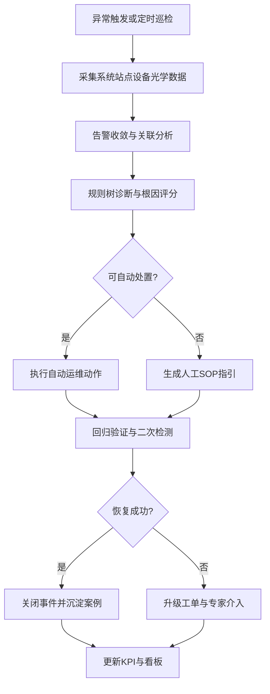

# 光通信自动诊断/自动运维/智能运维平台（AutoOps）PRD V1.0

## 1. 文档信息
- 文档版本：V1.0（需求梳理版）
- 面向对象：一线操作员、线长、测试工程师（TE）、工艺工程师（PE）、设备工程师（EE）、质量经理（QE）
- 产品定位：面向光通信硬件自动化测试产线，建设“自动诊断 + 自动运维 + 智能运维”闭环平台
- 部署策略：厂内私有化优先（On-Prem First），支持边缘侧实时执行与中心侧汇总分析

## 2. 背景与问题定义
### 2.1 业务背景
光通信产线（尤其涉及光模块/光器件自动化测试）在量产阶段常出现“频繁爆错、定位慢、恢复慢、经验依赖强”的问题。异常常由多因素叠加触发：上层系统依赖、站点设备通信、版本配置偏差、关键器件状态漂移、光路链路插损异常等。

### 2.2 当前痛点
- 异常定位路径长：操作员从报警到根因定位步骤多，跨系统排查成本高。
- 告警噪声大：同一根因触发多点告警，缺少告警收敛与优先级策略。
- 处置标准不一致：不同班次、不同人员动作差异大，恢复效率波动明显。
- 历史经验沉淀弱：故障案例、SOP、备件更换记录分散，复用率低。
- 运维指标不闭环：常见只看通过率，缺少 MTTR/误报率/自动处置成功率等核心指标。

### 2.3 机会点
- 产线可观测数据已具备基础：设备日志、测试数据、系统状态、DOM 参数。
- 自动化动作具备可执行性：重连、复位、服务重启、参数回滚、校准触发等。
- 一线对“可解释、可复现、可追责”的诊断流程需求明确。

## 3. 目标与范围
### 3.1 产品目标（V1.0）
- 将高频异常的平均定位时间降低 30%+。
- 将高频可自动处置场景的人工介入率降低 40%+。
- 建立覆盖“发现-诊断-处置-验证-复盘”的闭环流程。
- 输出可用于跨班组统一执行的标准化诊断与处置策略。

### 3.2 范围定义
- 覆盖层级：工位（Station）+ 线体（Line）+ 维修/备件/知识库（Full Lifecycle）。
- 适用对象：光通信硬件自动化测试场景（含光学、电学、通信类接口设备）。
- 部署范围：单工厂内网优先，后续可扩展多工厂联邦架构。

### 3.3 非范围（V1.0 不做）
- 复杂黑盒 AI 模型端到端自动决策（先采用规则优先）。
- 跨工厂全局优化调度（V1.5/V2 再做）。
- 非结构化文档全自动知识抽取（V1 以人工审核入库为主）。

## 4. 用户角色与核心场景
### 4.1 角色定义
- 操作员：执行上料/测试/初步处理，关注“下一步怎么做”。
- 线长：关注班次健康、异常分布、恢复时效与产出影响。
- TE/PE：维护测试流程、阈值、诊断规则与工艺参数。
- EE：处理设备通信、硬件状态、驱动与固件相关问题。
- QE/经理：关注 FPY、OEE、异常结构、改进闭环效果。

### 4.2 核心场景
- 开机/换班前健康检查（Pre-Check）。
- 批次切换前站点能力确认（Station Qualification）。
- 测试中异常快速诊断与自动处置（Run-Time Incident）。
- 故障后复盘、案例归档与知识复用（Post-Mortem）。

## 5. 核心业务流程

## 6. 需求来源映射（UDS 功能 -> 产品能力）
| UDS 检查域 | 对应产品模块 | 关键检测项 | 处置策略 | 主要责任角色 |
|---|---|---|---|---|
| System Check | 系统依赖健康中心 | MES/TMS/TAS/API/文件服务器/网络连通 | 自动重试、服务重启、网络诊断脚本、依赖降级 | TE/IT/线长 |
| Station Check | 工位能力校验中心 | 设备通信、驱动状态、HW/FW 版本、GR&R/GDS、电源质量 | 重连、驱动重载、版本拦截、校准触发、停线保护 | TE/EE |
| HW/SW/FW Check | 版本与配置一致性中心 | 固件/FPGA/CPLD 版本、默认配置、LUT 完整性 | 自动比对、配置回滚、版本阻断放行 | TE/EE/PE |
| HW Status Check | 器件健康监测中心 | PD/VOA/SW/Pump/DFB/TEC/MCU/EEPROM/SPI/I2C 稳定性 | 指令压力测试、状态重置、备件建议 | EE |
| Optical Performance Check | 光路诊断中心 | 断纤、熔接点 IL、链路预算、功率异常 | 光路定位建议、复测策略、复位/校准动作 | TE/PE |

## 7. 功能需求（V1.0）
### 7.1 F1 统一健康检查编排
- 支持三类触发：定时巡检、事件触发、人工触发。
- 支持按产品机种/工位模板化配置检测流程。
- 支持检查结果分级：阻断（Critical）/告警（Warning）/提示（Info）。

### 7.2 F2 规则引擎与诊断树
- 规则组织：系统层 -> 工位层 -> 模块层 -> 器件层 -> 光路层。
- 规则要素：条件、阈值、窗口期、优先级、置信度、动作绑定。
- 输出：根因候选 TopN、推荐动作、预估恢复时长、风险等级。

### 7.3 F3 自动运维动作库（Runbook）
- 动作类型：
  - 系统级：服务重启、接口重试、缓存清理、依赖切换。
  - 工位级：设备重连、端口复位、驱动重启、配置回滚。
  - 测试级：测试流程重跑、通道切换、校准流程触发。
- 动作保护：白名单、幂等校验、冷却时间、最大重试次数、审批开关。
- 动作结果：成功/失败、耗时、影响范围、回退日志。

### 7.4 F4 光通信专项诊断
- 支持 DOM/DDM 参数采集：Tx Power、Rx Power、Temperature、Laser Bias、Voltage。
- 支持阈值策略：High Alarm、High Warning、Low Warning、Low Alarm。
- 支持光路逻辑诊断：断纤怀疑、熔接点 IL 异常、通道功率漂移识别。
- 支持机种差异化阈值模板与工位校准系数。

### 7.5 F5 告警收敛与根因推荐
- 告警合并：同源告警、时间窗聚合、拓扑关联。
- 告警压制：已知抖动模式、维护窗口、低价值重复告警。
- 根因推荐：基于规则链路输出置信度分布并给出下一步动作。

### 7.6 F6 工单与知识库闭环
- 自动建单：自动处置失败或超时后自动升级工单。
- 案例沉淀：记录“症状-根因-动作-结果-验证数据”。
- 知识推荐：按机种/工位/告警类型推荐 SOP 与历史成功案例。
- 备件联动：关联器件健康分数，提示高风险备件与更换建议。

### 7.7 F7 多角色看板
- 操作员视图：当前阻断项、下一步操作、倒计时 SLA。
- 线长视图：班次异常热力图、恢复时长、停线风险。
- 工程师视图：规则命中、误报分布、动作成功率。
- 管理视图：FPY、MTTR、OEE、异常成本、趋势分析。

## 8. 非功能需求
### 8.1 性能与可用性
- 关键诊断链路 P95 响应时间 < 5 秒（规则判定+建议输出）。
- 关键页面可用性 >= 99.5%（厂内服务窗口内）。
- 单线体至少支持 200+ 并发状态采样点（可扩展）。

### 8.2 安全与审计
- 基于角色的访问控制（RBAC）与操作分级授权。
- 所有自动动作必须留痕：发起人/规则版本/执行结果/回退记录。
- 支持审计查询与导出（满足质量追溯需求）。

### 8.3 架构约束（On-Prem First）
- 边缘采集与执行节点部署在厂内网络，降低外网依赖。
- 中心服务支持内网高可用部署（主备或集群）。
- 预留云端接口，但 V1 不依赖公网云服务。

## 9. 数据与接口需求
### 9.1 数据源
- 制造系统：MES/TMS/TAS 工单、流程、判定数据。
- 设备层：控制器日志、驱动状态、通信状态、版本信息。
- 测试层：测试结果、步骤日志、失败码、重测数据。
- 光学层：DOM/DDM 实时与历史数据、阈值配置、告警事件。

### 9.2 接口要求
- 支持标准 API 与文件接口并行接入（便于兼容存量系统）。
- 支持设备协议适配层（串口/TCP/IP/厂商 SDK）。
- 支持事件总线（告警、动作、工单状态）统一发布订阅。

### 9.3 数据治理
- 字段标准化：统一异常码、动作码、工位标识、设备标识。
- 时钟同步：确保跨系统事件可关联。
- 质量规则：缺失率、延迟率、异常值比例监控。

## 10. KPI 与验收标准（V1）
### 10.1 核心指标
- FPY（一次通过率）：目标提升 2~5 个百分点（按机种分层评估）。
- MTTR（平均修复时长）：目标下降 30%+。
- 自动处置成功率：目标 >= 60%（限 V1 场景白名单）。
- 误报率（False Positive）：目标下降 30%+。
- 一次定位命中率：目标 >= 70%。
- 告警收敛率：目标 >= 40%（同源告警归并后）。

### 10.2 验收方式
- 对比基线：上线前连续 4 周 vs 上线后连续 4 周。
- 分层验收：按工位、机种、班次分维度验收，避免总体掩盖局部问题。
- 回归验证：关键规则与自动动作需通过仿真与灰度工位双验证。

## 11. V1 边界管理（必做/可选/不做）
### 11.1 必做（Must）
- UDS 五大检查域全部纳入。
- 高频 Top20 异常场景规则化诊断与 SOP 化处置。
- 自动动作白名单（低风险动作）落地与审计闭环。
- 基础看板与 KPI 统计上线。

### 11.2 可选（Should）
- 半自动根因推荐排序优化（含置信度解释）。
- 备件风险评分与消耗预测初版。
- 告警模式识别（规则+统计）增强。

### 11.3 不做（Won't, V1）
- 复杂深度学习预测模型在线闭环控制。
- 全厂多站点统一资源调度优化。
- 完全无人值守自动恢复（保留人工确认环节）。

## 12. 实施与里程碑
### 12.1 阶段规划
- Phase 1（0~1.5 个月）：需求冻结、数据梳理、规则框架与动作库设计。
- Phase 2（1.5~3 个月）：核心功能开发、单线体灰度、规则调优。
- Phase 3（3~4 个月）：扩大上线、知识库沉淀、验收复盘。

### 12.2 发布策略
- 灰度顺序：单机种单线 -> 多机种单线 -> 多线推广。
- 变更策略：规则版本化发布，支持快速回滚。
- 运营机制：每周异常复盘会 + 每月规则清理与增补。

## 13. 风险与应对
- 设备协议异构导致接入慢：建设标准适配层与接入优先级机制。
- 数据质量不稳定：先打通“字段标准 + 时钟同步 + 质量监控”底座。
- 规则维护成本上升：建立规则生命周期管理（创建/验证/下线）。
- 组织协同不足：明确 TE/EE/PE/QE 的规则 owner 与审批机制。

## 14. 行业基线参考（用于评审论证）
- DOM/DDM 行业常用监控参数与阈值等级（Tx/Rx、温度、偏置电流、电压）在网络设备运维场景中已广泛使用，可迁移到产线诊断监控体系。  
  参考：  
  - [Cisco Community - Digital Optical Monitoring (DOM)](https://community.cisco.com/t5/networking-knowledge-base/digital-optical-monitoring-dom/ta-p/3120342)  
  - [Cisco Meraki Documentation - Digital Optical Monitoring](https://documentation.meraki.com/Switching/MS_-_Switches/Operate_and_Maintain/How-Tos/Digital_Optical_Monitoring)
- 光模块 ATE 产线实践强调“多通道并行测试、模块化功能组合、自动报表与坏因统计”，与本 PRD 的工位自动诊断与运维闭环方向一致。  
  参考：  
  - [Semight - Optical Transceiver Tester ATE8104/ATE8108](https://en.semight.com/high-speed-transceiver-ate/optical-transceiver-tester-ATE8108-ATE8104)

## 15. 附录：一线访谈提纲（用于下一轮需求确认）
- 你每天最影响产出的 3 类异常分别是什么？
- 目前从报警到恢复最慢的步骤在哪里？
- 哪些动作你愿意系统自动执行？哪些必须人工确认？
- 你判断“恢复成功”的标准是什么（参数/时间/产出）？
- 你最需要系统在异常时给到哪三条信息？

